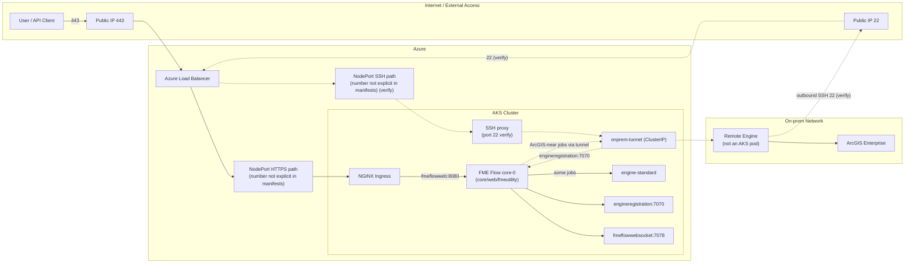

# FME Flow Hybrid Architecture (Simple)

Kort notering:
- Kontrollplan: FME Flow i AKS.
- Exekvering: antingen engine-standard i AKS eller on-prem Remote Engine.
- Faktiska FME-portar från projektet: 443 (extern), 8080 (fmeflowweb), 7070 (engineregistration), 7078 (websocket).
- Reverse SSH-tunneln möjliggör säker koppling till on-prem utan att Remote Engine blir en Kubernetes-pod.
