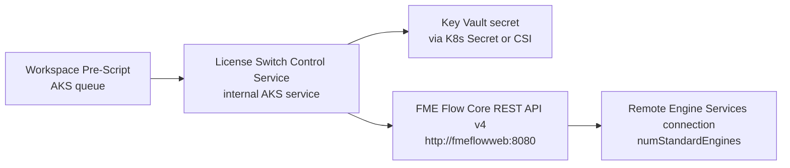

# Engine License Switch Control Service Design

## Goal
Provide a small internal AKS control service that owns the FME Flow API token and performs REMS license-switch operations on behalf of workspace pre-scripts.

This design avoids injecting a high-privilege FME Flow Core API token into every engine pod.

Desired baseline state:

- `1` Standard Engine active in AKS
- `1` Standard Engine assigned to REMS

The `2+0` configuration is treated as an explicit override mode, not the default steady state.

## Why this design

The current Helm export shows a fixed `env:` block in the engine deployment, but no verified chart-supported values hook for adding custom secret-backed environment variables to engine pods.

Because of that, directly injecting `FME_FLOW_API_TOKEN` into every engine pod would be:

- possible at Kubernetes level,
- but fragile across Helm upgrades,
- and broader in blast radius than necessary.

The control-service approach centralizes the privileged token and keeps the workspace pre-script lightweight.

## High-level flow



## Components

### 1. Workspace pre-script

Responsibilities:

- decide which switch mode is needed for the job
- call the internal control-service
- wait for a success/failure response
- stop the workspace early if the license switch failed

The pre-script should not talk directly to Key Vault and should not carry the Core admin token.

### 2. Control service

Responsibilities:

- receive a minimal internal request from the pre-script
- authenticate the request at an internal trust boundary
- read the FME Flow Core API token from an injected secret
- call FME Flow REST API v4
- update the REMS connection `numStandardEngines`
- poll until the requested status is reached
- return a small success/failure payload to the caller

### 3. Secret source

Preferred source:

- Azure Key Vault secret

Preferred delivery options:

1. Key Vault CSI driver mount into the control-service pod
2. synced Kubernetes Secret consumed by the control-service pod

Either option is acceptable. The important point is that the secret should be mounted only into the control-service workload, not into all engine pods.

## Suggested request model

The pre-script should send a small JSON request to the internal control-service.

Example:

```json
{
  "connectionName": "onPremEngineTest",
  "targetRemoteStandardEngines": 1,
  "targetRemoteDynamicEngines": 0,
  "expectedStatus": "online",
  "expectedReady": true,
  "timeoutSeconds": 180,
  "pollIntervalSeconds": 5,
  "requestId": "job-optional-correlation-id"
}
```

Recommended baseline payload for `1+1` mode:

```json
{
  "connectionName": "onPremEngineTest",
  "targetRemoteStandardEngines": 1,
  "targetRemoteDynamicEngines": 0,
  "expectedStatus": "online",
  "expectedReady": true,
  "timeoutSeconds": 180,
  "pollIntervalSeconds": 5
}
```

Recommended override payload for `2+0` mode:

```json
{
  "connectionName": "onPremEngineTest",
  "targetRemoteStandardEngines": 0,
  "targetRemoteDynamicEngines": 0,
  "expectedStatus": "unlicensed",
  "expectedReady": false,
  "timeoutSeconds": 180,
  "pollIntervalSeconds": 5
}
```

## Suggested response model

Success:

```json
{
  "ok": true,
  "connectionId": "uuid",
  "connectionName": "onPremEngineTest",
  "status": "online",
  "ready": true,
  "numStandardEngines": 1,
  "numDynamicEngines": 0
}
```

Failure:

```json
{
  "ok": false,
  "message": "Timed out waiting for REMS to reach ready state",
  "connectionId": "uuid",
  "status": "initializing",
  "ready": false,
  "numStandardEngines": 1
}
```

## Internal API shape for the control service

Minimal first version:

- `POST /switch`
  - switches `numStandardEngines` on the specified REMS connection
- `GET /healthz`
  - liveness/readiness probe

Optional later endpoints:

- `POST /test`
  - test the REMS connection through Core before switching
- `GET /connections/{name}`
  - return current REMS connection state for debugging

## FME Flow Core API calls the control service should use

The control-service should use these already verified Core endpoints:

- `GET /fmeapiv4/remoteengines`
- `GET /fmeapiv4/remoteengines/{id}`
- `PUT /fmeapiv4/remoteengines/{id}`
- `POST /fmeapiv4/remoteengines/{id}/test`
- `GET /fmeapiv4/remoteengines/{id}/engines`

Main control lever:

- `numStandardEngines`

Observed REMS statuses to handle:

- `offline`
- `online`
- `initializing`
- `unlicensed`

## Security posture

### What the pre-script should know

- internal control-service URL
- target connection name
- desired target mode

### What the pre-script should not know

- FME Flow Core admin token
- Key Vault secret material

### What the control service should know

- `FME_FLOW_BASE_URL=http://fmeflowweb:8080`
- FME Flow Core API token
- allowed REMS connection names, if you want to restrict scope

## Operational modes

### Mode A: `2+0`

- AKS keeps local capacity
- REMS remains connected but `Unlicensed`
- request payload uses `targetRemoteStandardEngines = 0`

### Mode B: `1+1`

- REMS receives `1` Standard Engine
- AKS effectively yields one license to REMS
- request payload uses `targetRemoteStandardEngines = 1`

Recommended default:

- Treat `1+1` as the normal baseline after startup.
- Use `2+0` only when a workspace explicitly needs to reclaim the remote license for AKS.

## Failure policy

The control service should fail fast when:

- the REMS connection cannot be found
- the Core API token is missing or rejected
- the REMS status does not converge before timeout
- the resulting REMS state is inconsistent with the requested `numStandardEngines`

The pre-script should abort the workspace when the service returns `ok = false`.

## Recommended first implementation order

1. Build the control-service as a tiny internal HTTP service.
2. Inject only the Core token into that service.
3. Call Core with `GET /remoteengines` and `GET /remoteengines/{id}` only.
4. Add `PUT /remoteengines/{id}` next.
5. Add polling and timeout handling.
6. Wire the workspace pre-script to call the internal service.
7. Validate `1+1` first as the primary acceptance test.
8. Validate `2+0` afterward as the override-mode test.

First acceptance test definition:

- AKS retains one licensed Standard Engine
- REMS receives one licensed Standard Engine
- both sides can run a test job successfully
- REMS status is `online` and `ready`

Prototype status:

- A first code prototype now exists at [scripts/engine_license_switch_control_service.py](scripts/engine_license_switch_control_service.py).
- It wraps the REMS switching logic over `POST /switch` and reuses the Core REST logic from [scripts/engine_license_switch.py](scripts/engine_license_switch.py).
- It is still a prototype: no deployment manifests, no token-delivery integration, and no hardened caller authentication beyond an optional shared bearer token.

## Open decisions

- whether to implement the control-service as:
  - a lightweight Python web service,
  - a one-shot Kubernetes Job launcher,
  - or a small Azure-hosted internal service reachable from AKS
- how to authenticate the pre-script to the control-service inside the cluster
- whether a successful switch should be reversed automatically after the workspace finishes